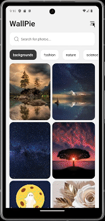

---

# WallPie - Photo Library

**WallPie** is a versatile photo library app built with React Native that allows users to explore, download, and search high-quality images. Using the Pixabay API, WallPie provides a seamless experience for discovering images and applying powerful filters, making it easy to find the perfect photo.

## Key Features

- **Search Functionality**: Quickly find images by keywords with the Pixabay API.
- **Filter Options**: Refine search results by applying filters such as color, size, and more.
- **Category**: Choose images from various categories.
- **Share Image**: Easily share images to with others.
- **Image Downloads**: Easily download images to your device.
- **Cross-Platform Compatibility**: Available on both mobile and web.

## Demo

<div  style="display: flex; flex-direction: 'row';">




</div>

## Screenshots

<div  style="display: flex; flex-direction: 'row';">


</div>

## Technologies Used

- **React Native** for cross-platform development
- **Pixabay API** for accessing a wide range of images
- **Expo** for seamless development and testing on different platforms.

## Prerequisites

- **Android Studio**: For running the app on Android Emulator
- **Git**: for cloning the repository
- **Environment**: Use this link as reference for setting it up [Link](https://reactnative.dev/docs/set-up-your-environment)
- **Pixabay_API**: You need pixabay API key to fetch images. refer to [this](https://pixabay.com/service/about/api/)

## Installation

1. **Clone the repository:**

   ```sh
   git clone https://github.com/MK884/wallpie.git

   cd wallpie
   ```

2. **Install dependencies:**
   ```sh
   npm install
   ```

## Setting Up Environment Variables

1. **Create a Copy of `.env.example`:**

   ```bash
   cp .env.example .env
   ```

2. **Fill in the environment variables:**

   Open the newly created .env files and replace placeholder values with your actual environment-specific values.

## Running the App

### For Android

1. **Start the Metro bundler:**

   ```sh
   npm run android
   ```

### For Web

1. **Start the Metro bundler:**

   ```sh
   npm run web
   ```

🎉🎉Congrats! You should now be able to see the app running on your Android emulator or connected device.
